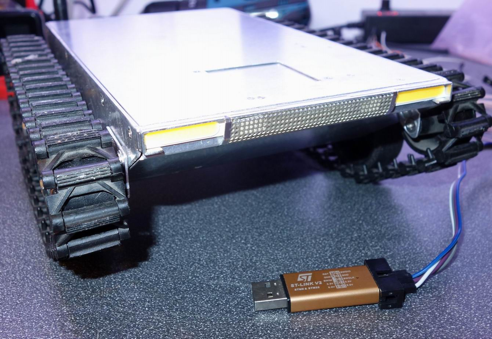
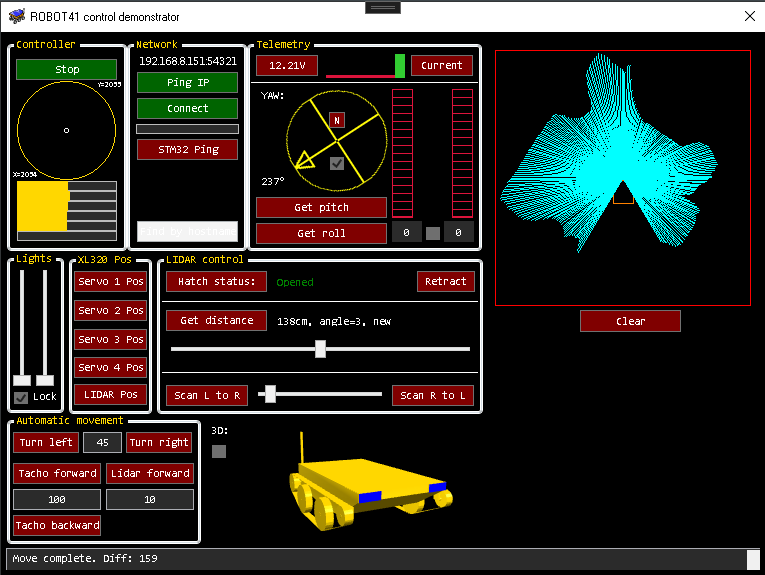
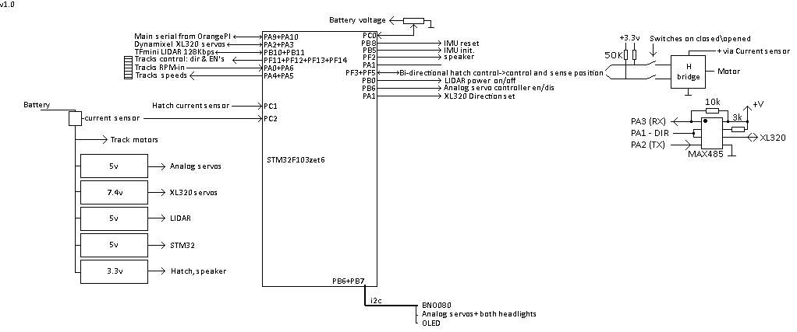
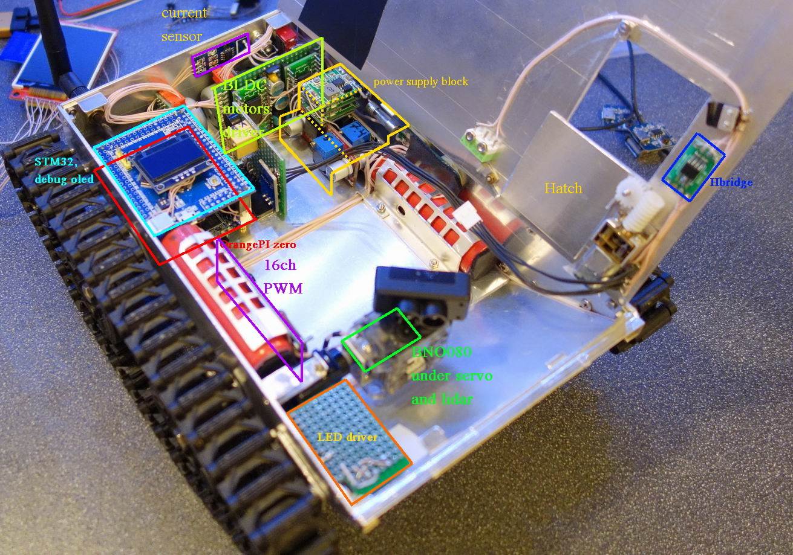

## ROBOT4 by (c)Airrr(r) 10.2024  
  
  
  
Control part can be implemeted in any language.  
See C# demonstrator example software for controlling details.  
  
  
  
The code is under development.  
  
  
  
Main abilities:  
- Very precise moving to any directions with simple joystick control:  
  Two BLDC motors with 120 degree hall sensors on the main shaft followed by 1:60 reductor.  
- Measure it’s own voltage and current consumption.  
- Knows it’s own yaw, pitch and roll.  
- Auto retractable hatch-covered 300-degree LIDAR. Over-current and sensors protection to prevent self-wounding.  
- 16 channels PWM for servos and headlights (right and left independable).  
- Can return it’s both current RPM’s form right and left tracks every 50ms. Not realy usefull function, but looks nice.  
- **Rotate automatically by any desired angle 1-180 cw or ccw.** Reporting back difference between actual and desired angles.  
  Once failed to rotate an error message being reported.  
- **Move forward automatically by any given distance. LIDAR based with centimeter resolution.**  
  Report back difference or any other error if occured.  
- **Move forward or backward automatically by tachometer based calculations with few MILLIMETERS resolution.**  
- Quickly get distance at any angle +-150 degrees.  
  So can draw a map of it's current location in 0.29 degree resolution and 0.3 to 1.2 meter range.  
- **Servo positions are readable.**  
  
OrangePI zero are used for converting udp to 0.5Mbps serial for **STM32f103zet6** as main controller:  
  
Also it sends video over network from h264 hardware usb camera.  
  
BNO080 as IMU.  
XL320 servos directly form STM32.  
PCA9685 16ch PWM controller.  
TFmini as LIDAR (LED actually).  
  
Next:  
- Attach arm with gripper and camera.  
  
&nbsp;  
  
&nbsp;
  
&nbsp;
  
&nbsp;
  
API:  
For list of commands see .doc file.  
In short you send and receive a packet of 5 bytes:  
First one is a start byte ("A").  
Second is COMMAND byte.  
Then two bytes of u_int DATA.  
At last xor of all of them.  
  
There is a special packeting to scan surrounding fast that involves other packet forming. But still the packet is a 5 bytes in a sequence starting with "A".  
On receive you'll get the same five-byte coding while structure of bytes remains the same as sending.  
  
&nbsp;
  
Chassis test: https://www.youtube.com/watch?v=97us4vYNSSo  
IMU test: https://www.youtube.com/watch?v=sDaEpY1wi44  
Motors test: https://www.youtube.com/watch?v=D2VgjsKLWxw  
 

  